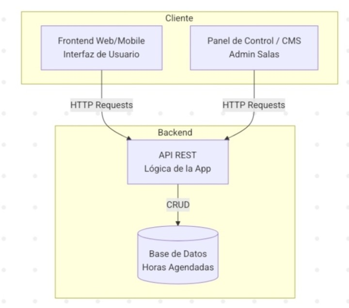

## 1. Estilo Arquitectónico

Estilo adoptado: Cliente-Servidor en capas

Justificación basada en REF priorizados:

| REF ID | Descripción                                                                | Prioridad | Cómo lo aborda el estilo |
|--------|----------------------------------------------------------------------------|-----------|--------------------------|
| REF-01 | El sistema debe responder en menos de 2 segundos en operaciones comunes    | Alta      | La separación entre cliente, backend y base de datos permite optimizar procesamiento y consultas |
| REF-02 | El sistema debe estar disponible al menos un 99% en horario operativo      | Alta      | La separación por capas facilita mantenimiento y disminuye impacto de fallos parciales |
| REF-03 | Solo usuarios autenticados pueden reservar, cancelar o modificar reservas  | Alta      | El backend centraliza la autenticación, autorización y validaciones de acceso |
| REF-04 | La interfaz debe ser simple e intuitiva para estudiantes y administradores | Alta      | El frontend se especializa en experiencia de usuario sin mezclar lógica de negocio |
| REF-07 | El sistema debe ser modular y de bajo acoplamiento                         | Alta      | La división por módulos funcionales reduce dependencias innecesarias |
| REF-10 | Los datos de reservas deben mantenerse consistentes en todo momento        | Alta      | La lógica de reservas se valida y persiste desde backend antes de confirmarse |

Explicación textual:  
Se adopta una arquitectura cliente-servidor en capas porque permite separar claramente la presentación, la lógica de negocio y la persistencia de datos. Esta elección es adecuada para el sistema de reserva de salas, ya que mejora mantenibilidad, seguridad, claridad del diseño y consistencia de la información. Además, permite incorporar funcionalidades de administración sin alterar el funcionamiento principal del sistema para estudiantes.

## 2. Diagrama de Arquitectura

## 3. Descomposición Modular

Fundamentación:  
La descomposición modular se realiza por funcionalidad del dominio, separando responsabilidades asociadas a estudiantes, reservas, salas y administración, con el objetivo de mantener alta cohesión y bajo acoplamiento.

### Módulo 1: Interfaz de Usuario
- Responsabilidad: Mostrar la información al usuario y permitir la interacción con el sistema
- Ofrece a otros módulos: Solicitudes de consulta, reserva, cancelación, edición y administración
- Depende de: Backend API

### Módulo 2: Gestión de Usuarios
- Responsabilidad: Administrar usuarios, su facultad y su rol dentro del sistema
- Ofrece a otros módulos: Información de usuario y validación contextual
- Depende de: Base de Datos

### Módulo 3: Gestión de Salas
- Responsabilidad: Administrar información de salas, ubicación, capacidad, equipamiento y disponibilidad
- Ofrece a otros módulos: Datos de salas y consulta de disponibilidad
- Depende de: Base de Datos

### Módulo 4: Gestión de Reservas
- Responsabilidad: Crear, cancelar, consultar y modificar reservas
- Ofrece a otros módulos: Estado actual e histórico de reservas
- Depende de: Gestión de Usuarios, Gestión de Salas, Base de Datos

### Módulo 5: Administración
- Responsabilidad: Gestionar salas, visualizar estadísticas de uso y configurar reglas del sistema
- Ofrece a otros módulos: Control administrativo, reportes y configuración
- Depende de: Gestión de Salas, Gestión de Reservas, Base de Datos

### Módulo 6: Backend API
- Responsabilidad: Exponer servicios REST al frontend y coordinar la lógica de negocio
- Ofrece a otros módulos: Endpoints para usuarios, salas, reservas y administración
- Depende de: Gestión de Usuarios, Gestión de Salas, Gestión de Reservas, Administración

### Módulo 7: Base de Datos
- Responsabilidad: Persistir usuarios, salas, reservas y reglas del sistema
- Ofrece a otros módulos: Almacenamiento y recuperación de información
- Depende de: Ninguno

## 4. Decisiones de Diseño

### Decisión 1
- Decisión: Utilizar una API REST como mecanismo de comunicación entre frontend y backend
- Motivación: Favorece separación de responsabilidades, mantenibilidad y escalabilidad (REF-01, REF-07, REF-09)
- Alternativas consideradas: Comunicación directa del frontend con la base de datos
- Impacto: Mejora seguridad, control de acceso y reutilización de servicios

### Decisión 2
- Decisión: Centralizar la validación de reservas en el backend
- Motivación: Garantizar integridad y consistencia en la disponibilidad de salas (REF-10)
- Alternativas consideradas: Validar únicamente desde frontend
- Impacto: Disminuye errores, evita reservas inconsistentes y mejora confiabilidad

### Decisión 3
- Decisión: Separar la administración en un módulo independiente
- Motivación: Las funcionalidades administrativas tienen responsabilidades distintas a las de los estudiantes y requieren operaciones de control específicas (REF-07)
- Alternativas consideradas: Integrar administración dentro del módulo de reservas
- Impacto: Mejora claridad del diseño y facilita evolución del sistema

### Decisión 4
- Decisión: Implementar autenticación obligatoria para acciones sensibles
- Motivación: Resguardar reservas, reglas del sistema y acciones administrativas (REF-03)
- Alternativas consideradas: Permitir acciones sin autenticación
- Impacto: Aumenta seguridad y control del sistema
